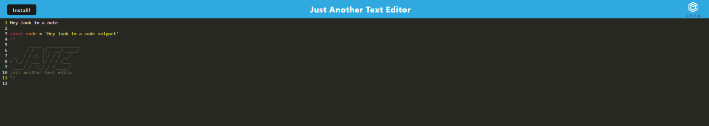

# Progressive Web App

## Description
In this challenge we created a text editor designed to help users create and manage notes or code snippets, whether they are connected to the internet or not. Users can reliably store and retrieve their content ensuring continuity even without access to the internet.

## Installation
Simply click the "install" button at the top left of the screen and the web app will be downloaded and a desktop icon will be created for quick access.

## Usage
Users can save code snippets or notes, either in the browser or in the web app if they choose to download.

## Screenshot

## Link
[Link to deployed Application](https://boiling-inlet-52111-4edbc198a6ce.herokuapp.com/)